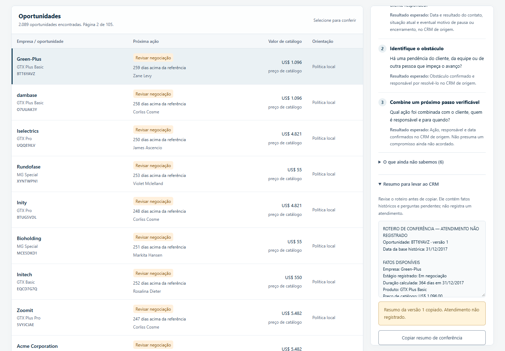

# Submissão de Thiago Emanuel Veloso Santos | Challenge 003

## Sobre mim

Nome: Thiago Emanuel Veloso Santos. LinkedIn: [thiagovelsa](https://www.linkedin.com/in/thiagovelsa/). Desafio escolhido: 003, Lead Scorer, Vendas e RevOps.

## Executive Summary

O Lead Desk organiza as 2.089 oportunidades abertas do dataset em filas de trabalho e explica a próxima ação sugerida. A análise encontrou ausência de empresa em 68,2% dessa carteira e falta de informações como necessidade, orçamento e último contato. A solução usa critérios explícitos para orientar a conferência desses dados e apresenta perguntas para o vendedor levar ao atendimento. O Jev foi testado como classificador, com concordância nos 120 casos do ensaio, mas as regras locais obtiveram o mesmo resultado; por isso, a consulta ao modelo é opcional. A recomendação é validar a utilidade das filas com vendedores antes de atribuir à ferramenta qualquer ganho de conversão.

## Solução

O código está em [solution/app](solution/app), com Go, TypeScript e PostgreSQL. O [guia da aplicação](solution/app/README.md) informa dependências, comandos de instalação e acesso. O dataset e os recibos do ensaio acompanham a entrega; não é necessária uma chave de API para abrir a carteira e consultar as orientações.

### Abordagem

O trabalho começou pela auditoria dos dados, antes da escolha dos critérios. A duração das oportunidades abertas e a ausência de informações comerciais limitaram o uso de previsões de fechamento. A política passou a separar revisão de negociação, qualificação, confirmação de próximo passo e cadastro. A [política de qualificação](solution/analise/POLITICA-QUALIFICACAO.md) detalha a ordem, os desempates e os limites de interpretação.

### Resultados / Findings

A carteira permite busca e filtros por vendedor, gestor e região, com escopo conferido no servidor. O detalhe mostra os motivos, fatos disponíveis, perguntas sugeridas e um resumo para copiar ao CRM. Alterações de empresa criam versões e invalidam classificações antigas. Busca, filtros, fila e página permanecem na URL ao recarregar.

Na última rodada de correções, passaram 49 verificações de interface, 17 testes principais de integração com o banco e 11 testes de recomendações. Os resultados e seus limites estão no [relatório de correções](solution/app/evidence/post-review-fixes/RELATORIO.md). A [conferência da entrega](docs/ENTREGA.md) registra a preparação do pacote e a verificação de instalação.

### Recomendações

Começar com um grupo de vendedores, conferir se as filas ajudam a escolher a próxima ação e registrar os motivos de discordância. Acrescentar dados de contato, necessidade e próximos passos ao CRM antes de avaliar uma previsão comercial. Manter o Jev como componente experimental enquanto não houver benefício adicional demonstrado em relação às regras locais.

### Limitações

Os dados são históricos, com referência em 31/12/2017, e não representam clientes atuais da G4. A prioridade é uma hipótese de organização do trabalho. Não foram demonstrados aumento de vendas, qualidade comercial independente das regras ou capacidade de produção multinacional. Autenticação corporativa, alta disponibilidade e recuperação operacional exigem trabalho adicional, descrito na [arquitetura](solution/STACK-ARQUITETURA.md).

## Process Log: como usei IA

### Ferramentas usadas

| Ferramenta | Participação |
|---|---|
| ChatGPT | Discussão inicial da proposta e das hipóteses. |
| Codex | Análise dos arquivos, programação, testes locais e documentação. |
| Agentes e skills no Codex | Revisões delimitadas de requisitos, interface, banco e evidências. |
| Jev pelo Vercel AI Gateway | Classificação segundo a política nos ensaios registrados. |

### Workflow

O processo passou pela leitura do desafio, auditoria dos dados, definição da política, comparação do Jev e do Router, construção da aplicação e revisões com testes. O [registro completo](process-log/README.md) reúne decisões, referências e 14 rodadas de construção, seguidas da organização desta entrega. Rodadas agrupam objetivos de trabalho; não representam a quantidade exata de mensagens ou chamadas de API.

### Onde a IA errou e como corrigi

A revisão encontrou uma confirmação de cópia que podia ficar fora da tela, uma leitura adicional antes de liberar a conexão do banco e falta de clareza sobre ferramentas e rodadas no registro do processo. Os problemas foram corrigidos e verificados. Durante a validação do ajuste de cópia, o teste móvel ainda encontrou parte do aviso fora da área visível; a rolagem foi ajustada e o teste passou.

A hipótese inicial de vantagem econômica e comercial do Jev também foi confrontada com evidências. Concordância com uma regra determinística não demonstra melhor priorização de vendas. Essa distinção ficou explícita na interface e na documentação.

### O que eu adicionei que a IA sozinha não faria

Propus usar o Jev como classificador e pedi a comparação com o Router. Questionei como a aplicação lidaria com vendedores trabalhando ao mesmo tempo e como os dados seriam preservados. Também pedi explicações que o atendente pudesse entender e revisões independentes antes do envio.

## Evidências

A [narrativa do processo](solution/analise/PROCESSO.md), o [ensaio do Jev](solution/analise/RESULTADO-JEV-VERCEL.md), a [comparação com o Router](solution/analise/RESULTADO-ROUTER-LOCAL.md) e os [testes da aplicação](solution/app/evidence/post-review-fixes/RELATORIO.md) acompanham o código. O índice em [process-log](process-log/README.md) orienta a leitura.

Pacote preparado em 22/09/2026. Submissão por Pull Request ainda não realizada.
