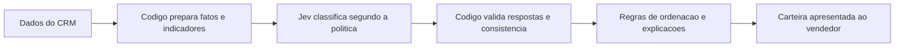

# Como o Jev é usado no Lead Desk

Atualizado em 22/09/2026. Este documento explica o papel do Jev, a integração e o alcance dos resultados obtidos. As descrições do modelo vêm da documentação do fornecedor consultada para o ensaio. As métricas vêm das execuções registradas no projeto.

## O que é o Jev

Jev é um modelo da TypeSafe que responde a perguntas com critérios definidos pela aplicação. Pode devolver uma escolha entre alternativas, uma pontuação ou probabilidades em campos que o código consegue verificar. A TypeSafe chama essa categoria de System One. A definição está no [conceito apresentado pelo fornecedor](https://docs.typesafe.ai/concepts/system-one).

No Lead Desk, Jev responde a duas perguntas: qual é a situação da qualificação e qual próxima ação corresponde à política. A atuação comercial continua sob responsabilidade do vendedor.

Jev é o modelo. Vercel AI Gateway é o serviço pelo qual o servidor envia as perguntas e recebe as respostas. Jev Browser é outra aplicação, voltada a automação de navegador, e não participa da classificação deste projeto.

## Como o fornecedor descreve a tecnologia

Segundo a TypeSafe, o treinamento usa RLCD, sigla de Reinforcement Learning for Calibrated Decisions. O método busca melhorar as decisões e a correspondência entre as probabilidades informadas e os resultados observados. Essa é uma descrição do fornecedor; não auditamos o treinamento. A explicação está no [material técnico da TypeSafe](https://docs.typesafe.ai/introduction/machine-learning-primer).

Essa correspondência é chamada calibração. Se muitas previsões comparáveis atribuem 80% a um evento, uma boa calibração corresponderia a observar o evento em aproximadamente 80% delas. Isso não garante o acerto individual nem demonstra que o modelo esteja calibrado para vendas.

Os 120 casos do projeto foram usados para comparar respostas, sem treinar ou ajustar os parâmetros do Jev. O modelo já estava disponível no provedor. As fontes consultadas não permitem verificar seu número de parâmetros, sua arquitetura interna completa ou os dados usados no treinamento.

## O que a aplicação envia e recebe

| Elemento | Conteúdo |
|---|---|
| `state` | Fatos da oportunidade, como estágio, existência de empresa, produto, datas e indicadores calculados. |
| Perguntas | Critérios e alternativas para a situação da qualificação e a próxima ação. |
| Resposta | Alternativas escolhidas, probabilidades e confiança, verificadas pelo servidor. |

A TypeSafe oferece três formas de pergunta. `Choice` escolhe uma alternativa; `Score` posiciona a resposta numa escala definida; `Noul` responde a uma condição de sim ou não com uma probabilidade. Perguntas enviadas juntas recebem o mesmo estado, mas não recebem as respostas umas das outras. Quando uma resposta depende de outra, o código precisa organizar as etapas. Consulte os [tipos de pergunta](https://docs.typesafe.ai/primitives).

No serviço de avaliação do Vercel, a pergunta binária é chamada `boolean`. O ensaio deste projeto usa apenas duas perguntas `choice` na mesma chamada por oportunidade. Existe uma alternativa de revisão humana, embora os 120 casos válidos não tenham exigido essa classe. O formato está na [documentação de avaliação do Vercel](https://vercel.com/docs/ai-gateway/modalities/evaluation).

## Como a consulta entra na aplicação

O diagrama mostra o caminho de uma consulta ao Jev. A carteira também funciona sem iniciar essa consulta, porque as regras locais já fornecem sua orientação.



Preparação, classificação, validação e ordenação estão implementadas. A interface apresenta motivos, perguntas sugeridas, edição local da empresa e histórico. O código calcula duração, presença de cadastro e referências históricas. As respostas do Jev não alteram automaticamente um CRM nem contatam clientes.

O servidor usa `POST https://ai-gateway.vercel.sh/v1/evaluate` com o identificador `typesafe-ai/jev`. O Gateway informa uso, roteamento e custo. O nome de modelo retornado no teste não identifica sua revisão interna exata, o que limita repetir o experimento nas mesmas condições no futuro. Consulte o [formato da integração](https://vercel.com/docs/ai-gateway/modalities/evaluation).

## Exemplo de uma resposta real

A oportunidade `NGTVHTFH` tinha uma negociação de `GTX Pro` iniciada em 19/12/2017, sem empresa identificada. Em 31/12/2017, sua duração era de 12 dias. A requisição completa incluía os demais indicadores e os critérios.

Para a situação da qualificação, Jev retornou:

```json
{
  "type": "choice",
  "choice": "incomplete_profile",
  "probabilities": {
    "human_review": 0.27,
    "incomplete_profile": 0.69,
    "negotiation_reviewable": 0.04,
    "discovery_required": 0
  },
  "confidence": 0.59
}
```

A próxima ação foi `identify_account`. As duas escolhas correspondem à política. Os valores acima foram observados e estão preservados em `resultados/jev-vercel-v02/chamadas.jsonl`.

A aplicação pode apresentar a orientação de identificar a empresa antes de avaliar seu perfil. Esse texto explica a regra aplicada a fatos conhecidos. Não representa acesso ao raciocínio interno do modelo.

## O que significam os percentuais

Em `Choice`, `probabilities` distribui probabilidade entre as alternativas fornecidas. `confidence` resume a concentração dessa distribuição. No exemplo, a alternativa escolhida recebeu 0,69 e a confiança foi 0,59. A [definição do fornecedor](https://docs.typesafe.ai/confidence) explica a diferença.

Esses números se referem à pergunta de classificação. Não representam a chance de fechar a venda ou o valor econômico de uma ação.

Um limite para aceitar respostas precisa ser testado para a tarefa. No grupo de avaliação, exigir confiança de pelo menos 0,8 nas duas perguntas teria aceitado 40 dos 60 casos, apesar de todos os 60 coincidirem com a política. Seriam necessários casos com erros e situações mais diversas para avaliar quando encaminhar uma resposta incerta à revisão humana. A [orientação sobre confiança](https://docs.typesafe.ai/confidence) trata dessa escolha.

## Comparação com regras e geração de texto

| Abordagem | Função possível | Limite observado |
|---|---|---|
| Regras em código | Calcular indicadores e aplicar condições explícitas. | Exigem transformar a política em lógica de programação; são a referência sem chamada externa para os critérios atuais. |
| Jev | Aplicar perguntas de classificação com alternativas definidas. | Depende de serviço externo, pode errar e precisa demonstrar benefício diante das regras existentes. |
| Modelo de geração de texto | Redigir conteúdo adaptado ou lidar com tarefas mais abertas. | Não foi testado neste ensaio; qualidade, tempo e custo exigem comparação na mesma tarefa. |

Modelos de geração de texto também podem retornar objetos num formato definido. Retornar JSON, por si só, não diferencia o Jev. A comparação precisa considerar qualidade e custo da resposta e funcionamento da integração. A documentação de [saídas estruturadas do AI SDK](https://ai-sdk.dev/docs/ai-sdk-core/generating-structured-data) descreve essa possibilidade.

A aplicação atual produz explicações com textos preenchidos a partir dos campos e critérios verificados. Um modelo adicional de geração de texto permanece uma possibilidade futura, caso exista necessidade demonstrada.

## O que motivou o uso do Jev

Minha proposta inicial foi usar um classificador especializado na qualificação e reservar geração de texto para tarefas que precisassem dela. A hipótese era obter decisões com custo e tempo de resposta adequados.

O ensaio confirmou que Jev aplica a política aos casos testados. A facilidade de expressar critérios em linguagem natural também pode ser avaliada quando a política evoluir. Ganho de manutenção, economia frente a outro modelo e benefício para vendedores ainda não foram medidos.

Os campos disponíveis e as condições atuais também permitem calcular as decisões em código. O servidor já faz esse cálculo e só aceita uma resposta Jev que concorde com ele. Por isso, o modelo não muda a decisão apresentada dentro da integração atual. O [estudo de sua contribuição](CONTRIBUICAO-JEV.md) discute o que seria necessário para avaliar valor adicional.

A base não contém conversas, necessidade declarada, orçamento de compra ou último contato. Nenhuma dessas informações é criada para justificar o uso do modelo.

## Resultados do ensaio

| Medida | Resultado |
|---|---:|
| Oportunidades com as duas escolhas iguais à referência | 120/120 |
| Casos reservados para avaliação | 60/60 corretos segundo a política |
| Tempo mediano da chamada completa | 396 ms |
| P95 das chamadas bem-sucedidas | 610 ms |
| Custo efetivo informado nas 120 respostas bem-sucedidas | US$ 0,00 |
| Erros temporários HTTP 429 recuperados por repetição | 2 |

P95 indica que 95% das chamadas medidas terminaram até aquele tempo. Os tempos da tabela não incluem a espera para repetir chamadas que receberam erro. O Gateway também informou valor de mercado agregado de US$ 0,00486381. O custo efetivo zero é uma observação desse ensaio, sem garantia de gratuidade futura.

A referência foi construída a partir das regras. Os resultados demonstram concordância com esses critérios nos exemplos testados. Não demonstram aumento de vendas, previsão de fechamento, calibração geral ou superioridade sobre outras abordagens.

Revisão humana e entradas contraditórias ainda precisam de ensaios próprios com o modelo. Os testes controlados da aplicação não substituem essa avaliação. O [relatório completo](RESULTADO-JEV-VERCEL.md) preserva método, resultados e limites.

## Controles mantidos pelo servidor

O servidor valida as alternativas, as probabilidades e a compatibilidade das respostas com os fatos. Mantém dados ausentes como desconhecidos e identifica a origem de cada orientação.

O PostgreSQL guarda versões dos dados e dos critérios para reutilizar somente respostas compatíveis. Pedidos já desatualizados são descartados antes do processamento. Falhas temporárias permitem até três tentativas, e o histórico registra resultados e interrupções. A credencial fica no servidor, fora dos arquivos públicos.

A política comercial, as explicações e a responsabilidade pela decisão continuam definidas pelo projeto e pelo vendedor. A avaliação com usuários ainda precisa verificar se o conjunto ajuda a conduzir o atendimento.
